# Instalasi Git pada Windows  
###### [ [KEMBALI](https://github.com/liberated-guardian/01-git-github) ]  
Sebelumnya download Git Installer terlebih dahulu di [sini](https://git-scm.com/downloads). Setelah itu jangan lupa download *Text Editor* terlebih dahulu, contohnya [Notepad++](https://notepad-plus-plus.org/downloads/) atau [Visual Studio Code](https://code.visualstudio.com/). Jika Git Installer dan Text Editor sudah anda install, maka langsung saja ke cara instalasinya:
1. Setelah download Git, jalankan filenya lalu pada tampilan utama akan ada lisensi, next saja.  
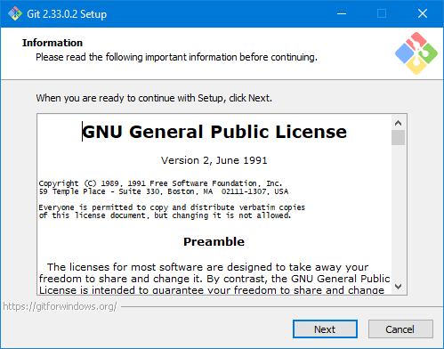
2. Pilih lokasi instalasi Git, jika ingin di install pada lokasi default maka next saja, jika tidak maka klik *Browse* lalu pilih ingin diinstall dimana.  
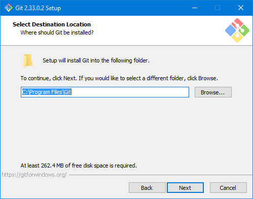
3. Selanjutnya akan disuruh memilih komponen dari Git yang akan diinstall, biarkan seperti default saja lalu next.  
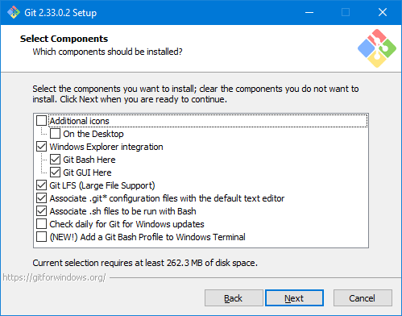
4. Installer akan memberikan tawaran mengenai folder yang akan dibuat pada start menu windows. Folder yang dibuat dapat diganti namun opsional, klik next.  
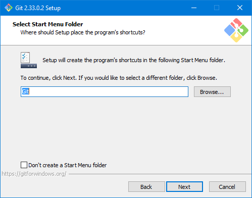
5. Pilih text editor yang akan digunakan, disini saya akan menggunakan VSCode dari Microsoft.  
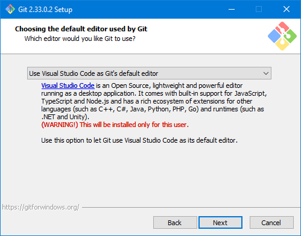
6. Pada saat menginstall, akan ditanya apakah ingin mengganti nama Branch atau Cabang utamanya, disini saya memilih Let Git decide karena jika kurang cocok dengan nama yang diberi oleh Git kita dapat menggantinya nanti.  
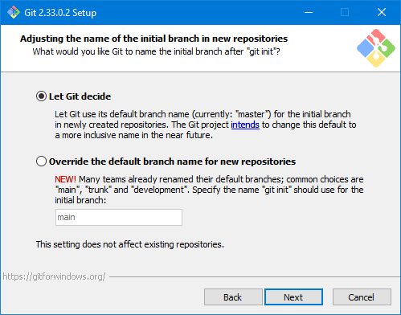
7. Setelah itu akan ditanya mengenai cara menggunakan Git, pilihan pertama berarti Git hanya dapat digunakan melalui Bash (aplikasi bawaan dari Git), pilihan kedua berarti Git dapat diakses menggunakan aplikasi bawaan dan aplikasi pihak ketiga. Saya disini menggunakan pilihan kedua, karena saya akan menggunakan Bash dan VSCode untuk mengakses Git.  
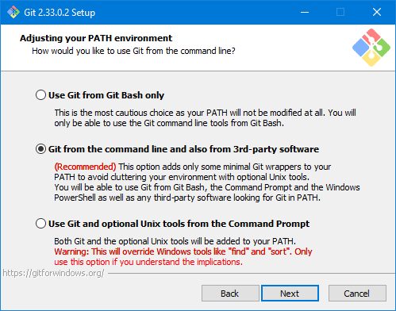
8. Pilih Use bundled openSSH, karena jika memilih opsi kedua anda harus mencari openSSH secara terpisah.  
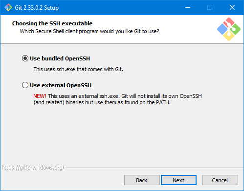
9. Pilih OpenSSL library agar mempermudah Git dalam memvalidasi server yang akan diakses, seperti GitHub, GitLab, dll.  
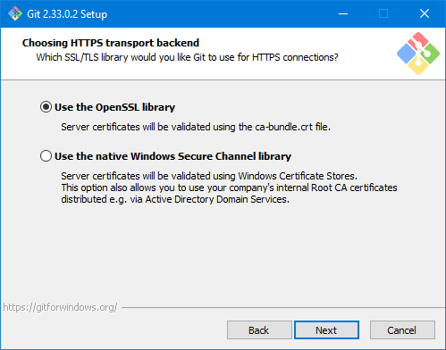
10. Gunakan CRLF atau pilihan pertama untuk konveksi akhir baris.  
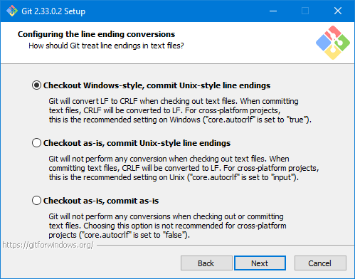
11. Pilih MinTTY untuk terminal yang akan digunakan oleh Git Bash.  

12. Pilih Default saja, agar dapat menggunakan fast-forward dan merge.  
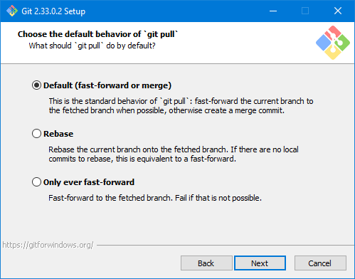
13. Gunakan Git Credential Manager Core, karena itu sudah support cross-platform.  
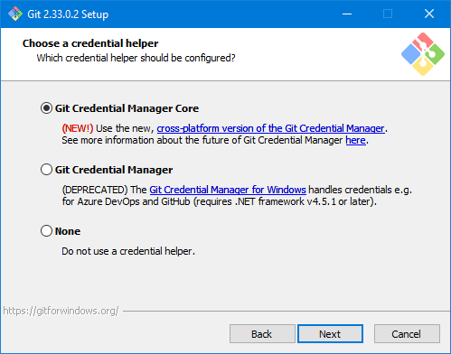
14. Disini aktifkan file system caching agar Git dapat bekerja lebih cepat.  
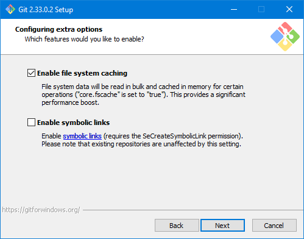
15. Pada opsi ini, saya tidak menggunakan keduanya, karena masih dalam tahap Experimental, tentunya masih banyak bug.  
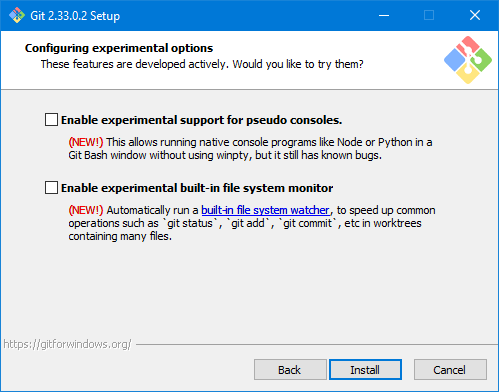
16. Tunggu proses install dari Git hingga selesai.  
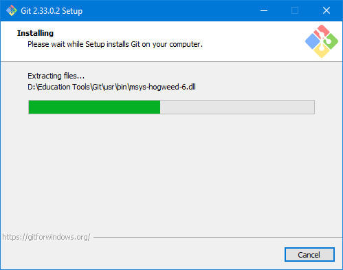
17. Jika sudah, klik finish saja.  
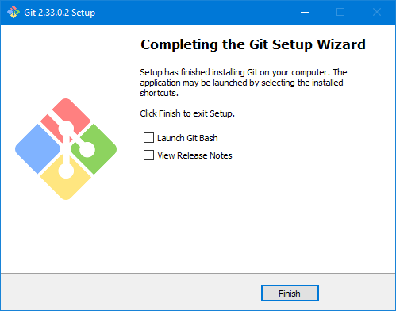
18. Untuk memeriksa versi, dan untuk validasi apakah Git sudah terinstall kita bisa cek melewati Command Prompt pada Windows. Gunakan perintah `git --version`.
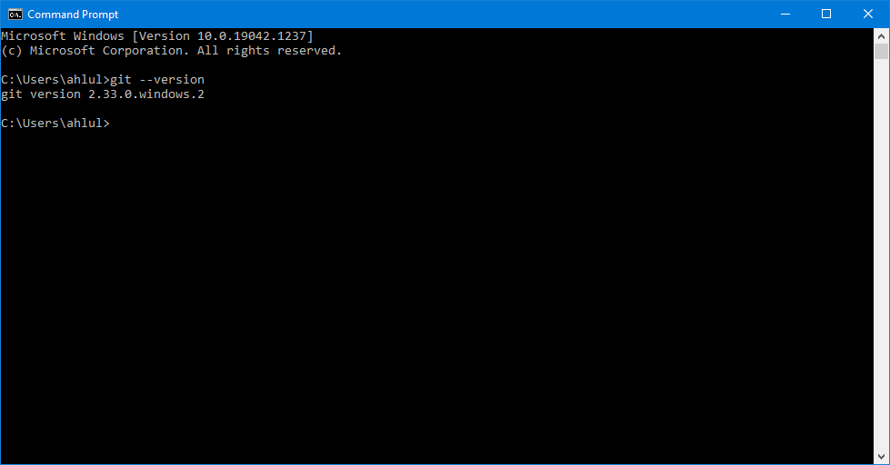  
Jika sudah muncul versi dari Git yang sudah diinstal dan sesuai dengan Git yang didownload maka bisa lanjut ke [Konfigurasi Git](https://github.com/liberated-guardian/01-git-github/blob/main/Konfigurasi-Git.md).