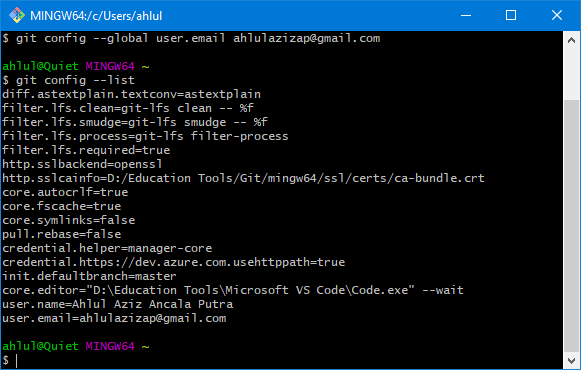

# Konfigurasi Git  
###### [ [KEMBALI](https://github.com/liberated-guardian/01-git-github) ]  
Sebelum mulai membuat Repo pada GitHub, sebagai pengguna Git kita setidaknya harus dapat mengubah email dan username pada file lokal. Email dan Username yang kita tetapkan pada konfigurasi ini akan dapat digunakan oleh GitHub untuk melihat catatan perubahan yang terjadi pada Repo. Pada OS Windows, file konfigurasi ini terdapat pada **C:\users\\(nama PC anda)** dengan nama file **.gitconfig**. Berikut cara mengganti email dan usernamenya dengan menggunakan Git Bash:  
```
$ git config --global user.name "Nama Anda"
$ git config --global user.email emailanda@domain.com
```
Pastikan mengisi nama dan alamat email yang sesuai dengan akun GitHub anda, jika sudah dapat dipastikan kembali dengan menggunakan perintah sebagai berikut:
```
$ git config --list
```
Lalu kurang lebih akan keluar seperti ini:  
  
Dapat dilihat pada 2 baris akhir, terdapat username dan alamat email saya.  

Jika sudah sesuai dengan akun GitHub, maka dapat lanjut ke [Pengelolaan Repo](https://github.com/liberated-guardian/01-git-github/blob/main/Pembuatan-dan-Pengelolaan-Repository.md).