# Pembuatan dan Pengelolaan Repository
###### [ [KEMBALI](https://github.com/liberated-guardian/01-git-github) ]  
Sebagai pengguna Git dan GitHub, kita dapat membuat Repository (biasa disingkat Repo) di GitHub. Repo tersebut bisa dibuat public maupun private sesuai kebutuhan. Repo dapat digunakan sebagai penyimpanan digital. Repo yang ada pada GitHub ini juga tersedia pada file lokal. Dengan demikian penyimpanan pada kedua Repo harus disinkronisasi, cara agar keduanya dapat sinkron atau sama adalah dengan menggunakan **Push**, yaitu dengan meng-upload file lokal pada GitHub dan juga **Pull**, yaitu download file dari GitHub untuk disimpan pada file lokal.  
##### **Catatan: Langkah-langkah dibawah dilakukan menggunakan [VSCode](https://code.visualstudio.com/).**
## Membuat Repository
Untuk membuat Repo baru, ikutilah langkah seperti berikut:  
1. Klik tanda **+** pada kanan atas, lalu klik **New Repository**.  
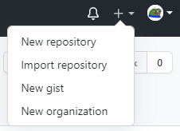  
2. Beri nama untuk Repo yang akan dibuat, lalu isikan deskripsi (opsional).  
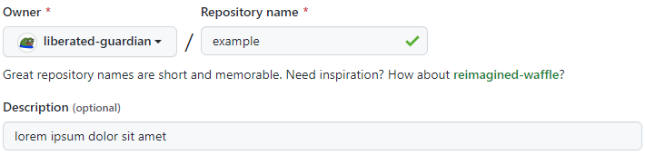  
3. Pilihlah antara **Public** atau **Private** untuk Repo yang ingin anda buat.  
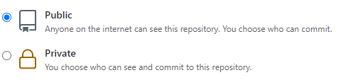  
4. Klik **Create Repository**.  
  
Setelah itu Repo yang sudah dibuat dapat diakses pada `https://github.com/<username>/<nama repo>`.  
## Clone Repository
Proses **clone** dilakukan untuk menduplikat Repo yang dibuat pada GitHub pada file lokal. Untuk melakukan **clone**, lakukan langkah seperti berikut:  
1. Pertama download ekstensi [ini](https://marketplace.visualstudio.com/items?itemName=GitHub.vscode-pull-request-github), ekstensi tersebut dapat membantu VSCode dalam mengerjakan Git.  
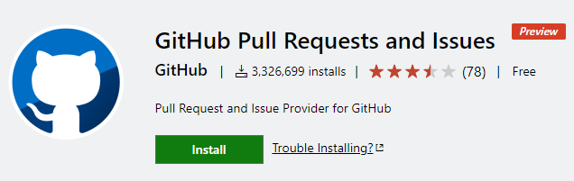  
2. Setelah itu buka ulang VSCode, pada Explorer klik pada **Clone Repository** lalu **Clone from GitHub**.  
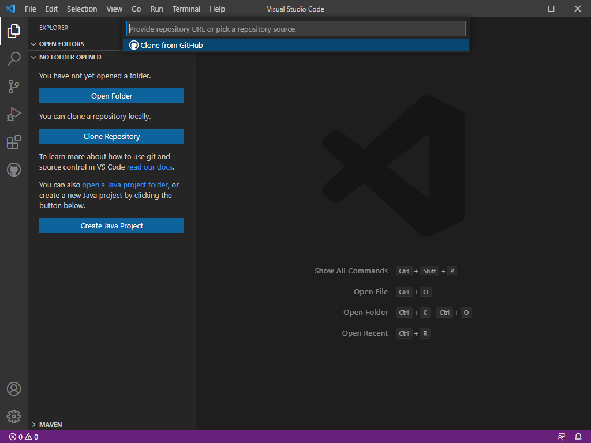   
3. Nanti akan diminta untuk menyambungkan akun GitHub dengan VSCode, ikuti saja perintahnya. Jika sudah, nanti bisa memilih mana Repo yang ingin di clone.  
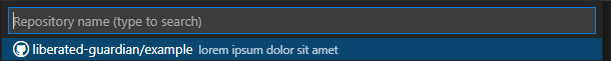  
4. Setelah itu diminta untuk memilih folder dimana **Clone** dari Repo akan disimpan. Saya memilih lokasi default dari VSCode berikan atau seperti gambar dibawah.  
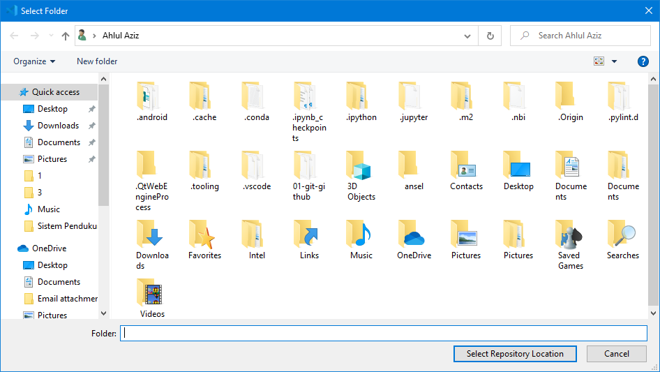  
Jika sudah, dapat dilihat pada file lokal yang sudah dipilih di langkah 4, didalam folder tersebut seharusnya terdapat nama folder yang sesuai dengan nama Repo yang barusan anda buat, namun tidak ada isinya atau kosong melainkan hanya folder yang memiliki nama sama seperti Repo yang telah dibuat. Setiap Repo memiliki branch atau cabang, secara default cabang utama yang dibuat akan bernama **master**, kita akan ubah cabang utama tersebut menjadi **main**. Berikut caranya pada VSCode:  
- Pada VSCode, klik Source Control, ikuti gambar dibawah.  
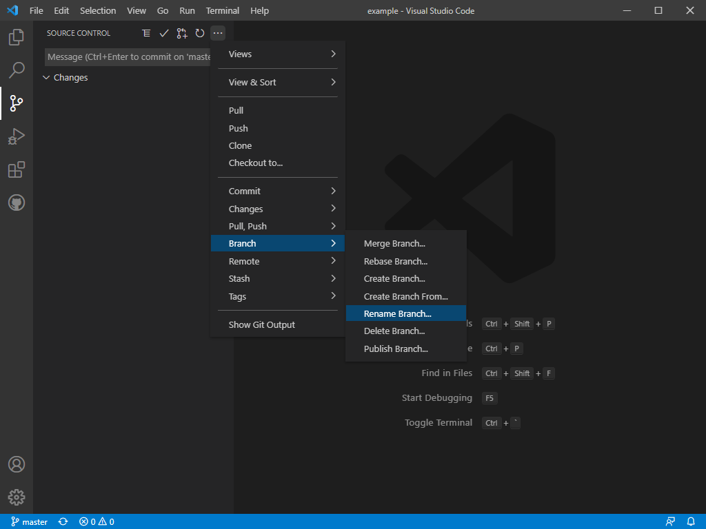  
- Lalu isikan **main** pada tempat yang tersedia.  
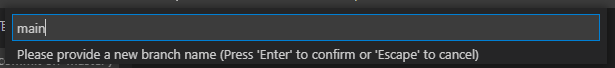  
Jika sudah maka dapat dilihat dikiri bawah terdapat tulisan **main**. Lalu buka Terminal pada VSCode dan ketikkan `git branch --set-upstream-to origin/main`.  
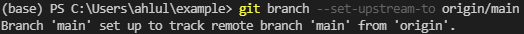  
## Pengelolaan Repository
Setelah **clone** ke komputer lokal, semua konten yang diubah atau diedit pada file lokal hasilnya akan di-*push* ke remote Repo di GitHub. Dengan demikian, sebisa mungkin konsisten dengan penggunaan remote lokal. Jika Repo lokal, **clone** ulang ke direktori yang kosong setelah itu baru lakukan pengelolaan Repo.
### **Commit tanpa Branching dan Merging**
Perubahan pada file lokal bisa terjadi karena beberapa hal berikut:  
1. File dihapus.  
2. File diedit.  
3. Membuat file baru.  
4. Menghapus direktori.   
Setelah melakukan satu atau beberapa hal diatas, lakukan *push* ke Repo GitHub. Contohnya sebagai berikut:  
- Buat file baru bernama README dengan ekstensi .md pada direktori Repo, lalu isikan "Bebas".  
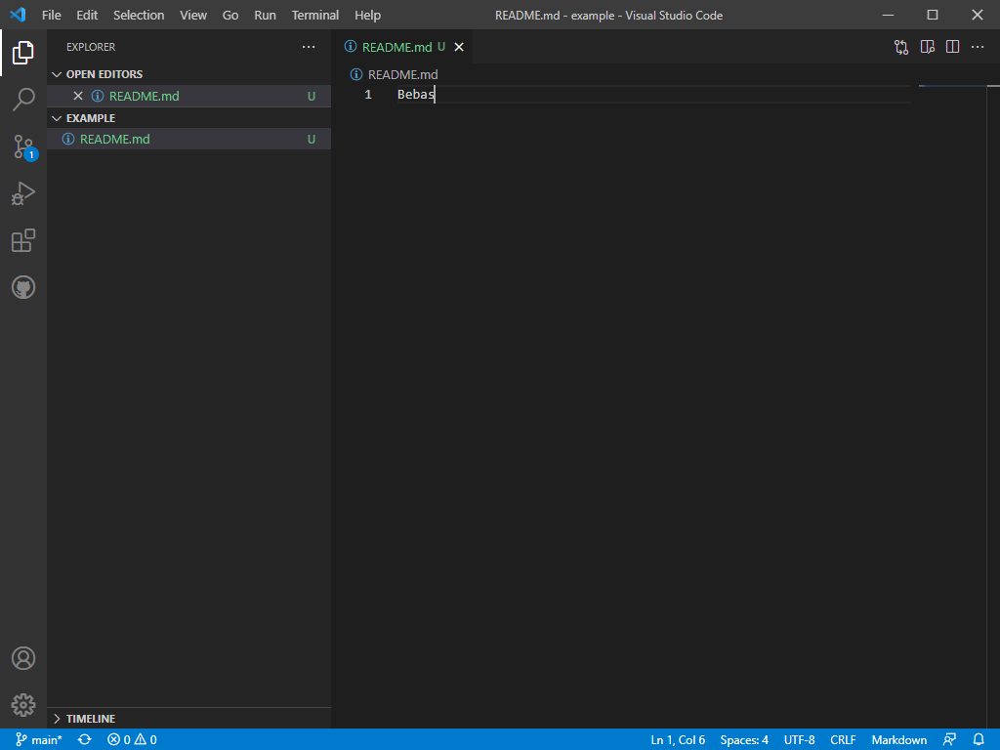  
Dapat dilihat itu terdapat symbol "U" yang dimaksud Untracked.
- Navigasi ke Source Control, klik *commit* (logo checklist) lalu *yes*.  
  
- Lalu tambahkan *comment* untuk *commit* yang akan dilakukan.  
  
- Setelah itu lakukan sinkronisasi dengan menggunakan *push to* atau *sync*.  
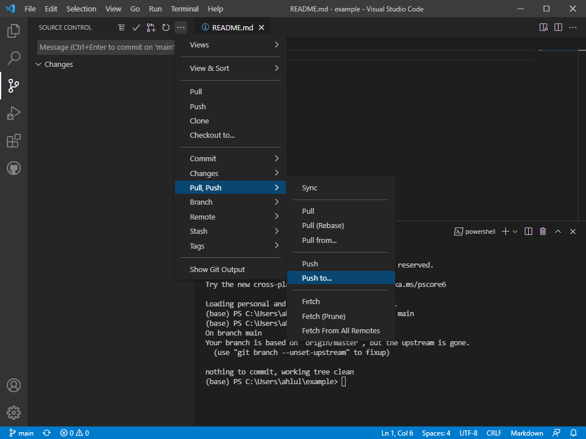  
Cara ini cukup simple memang, tapi jika terjadi kesalahan susah dalam memperbaiki. Lebih bagus jika kita menggunakan metode *branching* dan *merging*.  