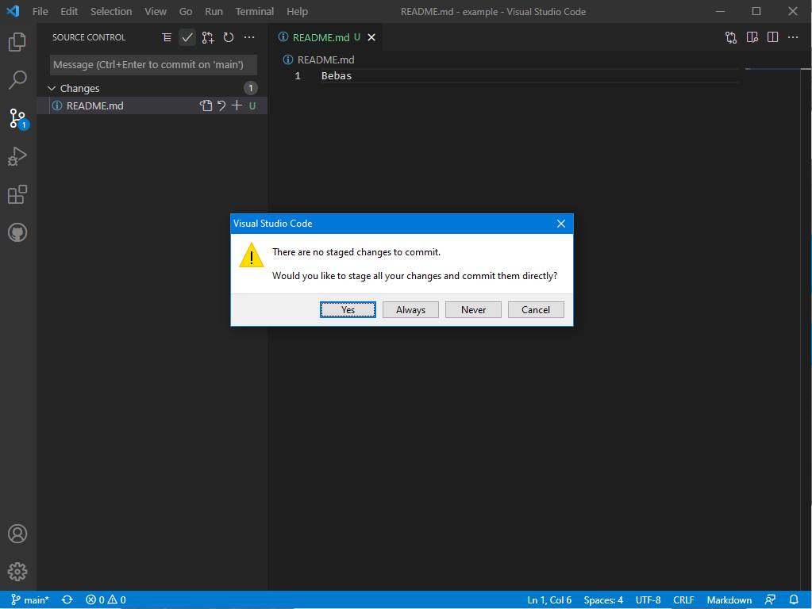
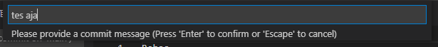
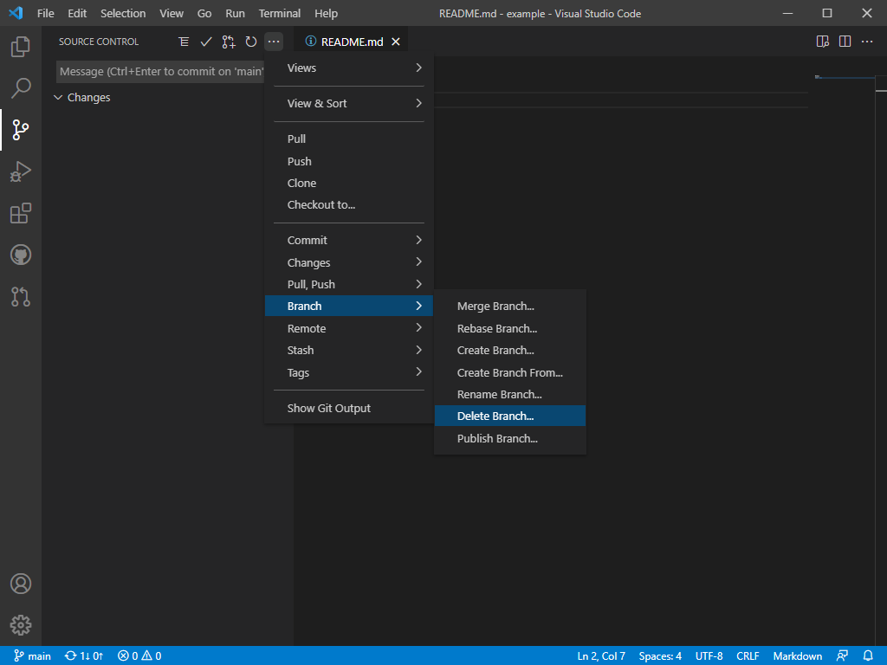

# Pembuatan dan Pengelolaan Repository
###### [ [KEMBALI](https://github.com/liberated-guardian/01-git-github) ]  
Sebagai pengguna Git dan GitHub, kita dapat membuat Repository (biasa disingkat Repo) di GitHub. Repo tersebut bisa dibuat public maupun private sesuai kebutuhan. Repo dapat digunakan sebagai penyimpanan digital. Repo yang ada pada GitHub ini juga tersedia pada file lokal. Dengan demikian penyimpanan pada kedua Repo harus disinkronisasi, cara agar keduanya dapat sinkron atau sama adalah dengan menggunakan **Push**, yaitu dengan meng-upload file lokal pada GitHub dan juga **Pull**, yaitu download file dari GitHub untuk disimpan pada file lokal.  

##### **Catatan: Langkah-langkah di bawah dilakukan menggunakan [VSCode](https://code.visualstudio.com/).**

## Membuat Repository
Untuk membuat Repo baru, ikutilah langkah seperti berikut:  
1. Klik tanda **+** pada kanan atas, lalu klik **New Repository**.  
  

2. Beri nama untuk Repo yang akan dibuat, lalu isikan deskripsi (opsional).  
  

3. Pilihlah antara **Public** atau **Private** untuk Repo yang ingin anda buat.  
  

4. Klik **Create Repository**.  
  
Setelah itu Repo yang sudah dibuat dapat diakses pada `https://github.com/<username>/<nama repo>`.  

## Clone Repository
Proses **clone** dilakukan untuk menduplikat Repo yang dibuat pada GitHub dan men-*download* Repo tersebut agar tersedia pada file lokal. Untuk melakukan **clone**, lakukan langkah seperti berikut:  
1. Pertama download ekstensi [ini](https://marketplace.visualstudio.com/items?itemName=GitHub.vscode-pull-request-github), ekstensi tersebut dapat membantu VSCode dalam mengerjakan Git.  
  

2. Setelah itu buka ulang VSCode, pada Explorer klik pada **Clone Repository** lalu **Clone from GitHub**.  
   

3. Nanti akan diminta untuk menyambungkan akun GitHub dengan VSCode, ikuti saja perintahnya. Jika sudah, nanti bisa memilih mana Repo yang ingin di clone.  
  

4. Setelah itu diminta untuk memilih folder dimana **Clone** dari Repo akan disimpan. Saya memilih lokasi default dari VSCode berikan atau seperti gambar dibawah.  
  

Jika sudah, dapat dilihat pada direktori yang sudah dipilih di langkah 4, didalam direktori tersebut seharusnya terdapat nama folder yang sesuai dengan nama Repo yang barusan anda buat, namun tidak ada isinya atau kosong. Setiap Repo memiliki *branch* atau cabang, secara default cabang utama yang dibuat akan bernama **master**, kita akan ubah cabang utama tersebut menjadi **main**. Berikut caranya pada VSCode:  

1. Pada VSCode klik *Source Control*, lalu cari **Rename Branch** pada *more action > Branch*.  
  

2. Lalu isikan **main** pada tempat yang tersedia.  
  
Jika sudah maka dapat dilihat dikiri bawah terdapat tulisan **main**. Lalu buka Terminal melewati View (kiri atas) pada VSCode dan ketikkan `git branch --set-upstream-to origin/main`.  
  

## Pengelolaan Repository
Setelah **clone** ke komputer lokal, semua konten yang diubah atau diedit pada file lokal hasilnya akan di-*push* ke remote Repo di GitHub. Dengan demikian, sebisa mungkin konsisten dengan penggunaan remote lokal. Jika kehilangan Repo lokal, **clone** ulang ke direktori yang kosong setelah itu baru lakukan pengelolaan Repo.
### **Commit tanpa Branching dan Merging**
Perubahan pada file lokal bisa terjadi karena beberapa hal berikut:  
1. File dihapus.  
2. File diedit.  
3. Membuat file baru.  
4. Menghapus direktori.   

Setelah melakukan satu atau beberapa hal diatas, lakukan *push* ke Repo GitHub. Contohnya sebagai berikut:  

1. Buat file baru bernama README dengan ekstensi .md pada direktori Repo, lalu isikan "Bebas".  
  
Dapat dilihat itu terdapat symbol "U" yang dimaksud Untracked. 

2. Navigasi ke *Source Control*, klik *commit* (tombol checklist) lalu *yes*.  
  

3. Lalu tambahkan *comment* untuk *commit* yang akan dilakukan.  
  

4. Setelah itu lakukan sinkronisasi dengan menggunakan *push to* atau *sync*.  
  
Cara ini cukup simple memang, tapi jika terjadi kesalahan susah dalam memperbaiki. Lebih bagus jika kita menggunakan metode *branching* dan *merging*.  

### **Mengubah Isi dengan Branching dan Merging**
Dengan menggunakan metode *Branching* dan *Merging*, setiap kali melakukan perubahan maka perubahan tersebut akan terjadi pada cabang lain. Setelah itu cabang lain tersebut akan dapat disatukan dengan cabang utama dengan **Merge Branching**. Metode ini lebih aman jika saat melakukan perubahan terjadi suatu kesalahan maka kita dapat menghapus perubahan yang baru saja dibuat dimana kesalahan itu terjadi. Cara melakukannya adalah sebagai berikut:  

1. Buat cabang baru untuk menampung perubahan pada *Source Control* lalu **Create Branch** (*more action > Branch*) dan berikan nama cabang, saya memberi nama cabang tersebut "edit-1".  
  

2. Lakukan perubahan pada cabang "edit-1" (dapat dilihat dikiri bawah mana cabang yang sedang digunakan), misalnya saya tambahkan sesuatu dalam file README lalu saya save filenya. Dapat dilihat pada file README terdapat logo M, artinya Modified atau terjadi perubahan pada file.  
  

3. Setelah itu perubahannya akan kita *commit* dengan cara klik **Stage Changes** atau tombol +, lalu *commit* dengan klik tombol checklist dan berikan *comment* mengenai *commit* yang telah dilakukan.
  

4. Gunakan **Publish Branch** untuk meng-*upload* hasil perubahan yang dilakukan pada cabang baru tadi, di contoh ini nama cabang barunya adalah cabang "edit-1".  
  

5. Buatlah **Pull Request** pada GitHub, dengan cara klik **Compare & pull request**.  
  

6. Setelah itu klik **Create pull request**, dan lakukan *merge* dengan **Merge Pull Request**.
  

7. Setelah **Confirm Merge** di GitHub, jangan lupa untuk menghapus cabang baru tadi.  
  

8. Jika sudah dihapus pada GitHub, maka sekarang kita akan melakukan *merge* pada file lokal. *Merge* file lokal dapat dilakukan dengan **Merge Branch** lalu pilih dari cabang baru, dicontoh saya namanya "edit-1".  
  

9. Setelah itu kita akan hapus cabang baru tersebut pada file lokal, dengan cara **Delete Branch** lalu pilih cabang yang akan didelete.  
  

10. Terakhir, lakukanlah sinkronisasi antara file lokal dengan file GitHub dengan cara *Sync*.  
  

### **Membatalkan Perubahan**
Dengan menggunakan metode *Branching* dan *Merging* kita juga dapat melakukan pengulangan terhadap perubahan, efeknya adalah perubahan yang dibuat pada cabang baru itu akan dihapus dan dikembalikan sebelum diubah sama sekali. Berikut merupakan caranya:  

1. Pastikan membuat perubahan pada *branch* atau cabang yang berbeda.  
  
Dapat dilihat di gambar atas, pada file README sudah saya tambahkan beberapa perubahan.

2. Gunakan **Discard All Changes** untuk membatalkan semua perubahan yang sudah dibuat setelah melakukan *commit*.  
  
Hasilnya akan kembali seperti semula, seperti saat sebelum perubahan, atau dapat dilihat gambar dibawah.  
  

### **Undo Commit Terakhir**
Jika pada suatu saat kita terlanjur melakukan *push* perubahan ke GitHub, dan ternyata perubahan tersebut salah atau tidak sesuai maka kita bisa melakukan *undo*. Berikut merupakan file yang akan saya buat contoh untuk melakukan *undo*.
  
Pada gambar diatas, saya telah melakukan 2 kali *commit* yaitu untuk menambahkan "EDIT 2" dan "EDIT 3" secara terpisah. Berarti untuk *undo* disini akan menghilangkan perubahan terakhir yaitu "EDIT 3". Berikut merupakan caranya:  

1. Gunakan **Undo Last Commit** yang sudah disediakan pada VSCode, yaitu pada bagian Source Control klik *more action > commit > **Undo Last Commit***.  
  

2. Setelah itu hasilnya akan menjadi sama seperti sebelum di *commit*, lalu gunakan **Unstage All Changes** dan **Discard All Changes** yang ada pada *more action > changes*. Hasilnya kurang lebih akan menjadi seperti berikut:  
  

3. Selanjutnya kita hanya tinggal melakukan *push* ke Repo GitHub saja. Dikarenakan **Undo Last Commit** merupakan *reset* bukan *revert* maka kita harus paksa *push* ke Repo GitHub. Cara untuk melakukan *force push* adalah dengan membuka Terminal pada VSCode lalu gunakan `git push -f origin main`.
  

**Undo Last Commit** juga dapat digunakan saat sudah *commit* namun terdapat suatu kesalahan pada *commit* tersebut dan tidak ingin *commit* tersebut di-*push* ke Repo GitHub.

Git juga membolehkan kita untuk mengembalikan Repo ke *commit*-*commit* sebelumnya, namun kita harus memilih pada *commit* mana kita akan mengembalikan Reponya. Hal tersebut dapat dilakukan dengan `git revert <commit>`. Secara contoh saya akan coba *revert* file dibawah.  

Saya akan mencoba kembalikan file tersebut ke *commit* pertama, dimana saya menambahkan kata "Bebas" disana. Berikut merupakan langkah-langkahnya:  

1. Buka Terminal pada VSCode.  

2. Lihat *log* dari Git dengan menggunakan `git log --oneline`.  

3. Dapat dilihat pada langkah 2, target *commit* saya adalah 66a1b01. Maka saya ketikkan `git revert 66a1b01` pada terminal.  

4. Setelah melakukan *revert* kita disuruh untuk me-*resolve* file, maka editlah sesuai kebutuhan lalu simpan file tersebut. Seperti yang saya bilang tadi, saya akan mencoba *revert* ke *commit* pertama, maka tulisan EDIT 1 dan EDIT 2 akan saya hapus.  

5. Lanjutkan proses *revert* dengan menambahkan file README baru (`git add README.md`) lalu `git revert --continue` dan tinggalkan sebuah message karena *revert* dihitung sebagai *commit* baru.  

6. Terakhir kita harus melakukan *push* ke Repo GitHub.  
